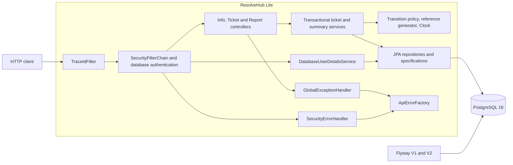
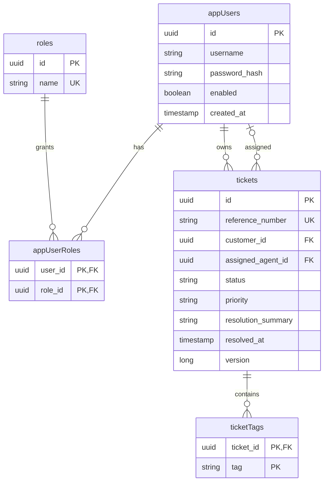
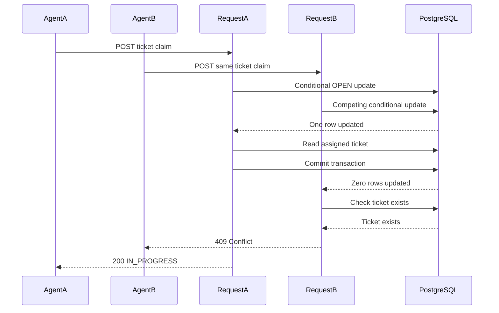

# ResolveHub diagrams

These diagrams document code structure, schema and intended transaction
ordering.

## Components

All Java layers below run inside one Spring Boot application, not separate
deployments. Dependency arrows point toward the called component.

## Entity relationships

`appUsers`, `appUserRoles` and `ticketTags` correspond to SQL tables
`app_users`, `app_user_roles` and `ticket_tags`. The username unique index is
on `LOWER(username)`, not a case-sensitive username constraint. Selected
columns are shown; the migration files are the complete schema.

## Competing claims

Both authenticated SUPPORT_AGENT requests can arrive together. This example
shows A winning; B can equally win. PostgreSQL serializes conflicting row
updates. B's predicate is rechecked after A commits; no retry can overwrite A.

